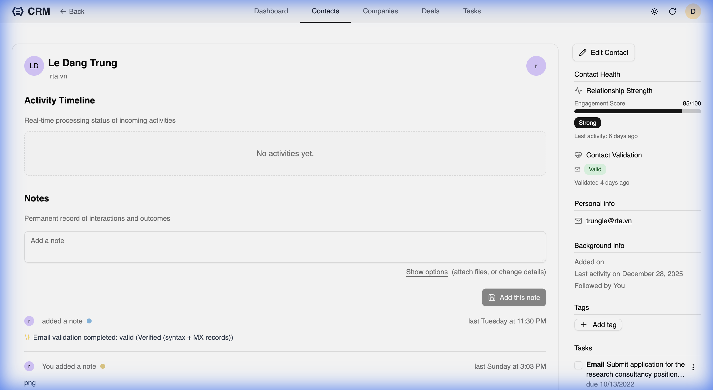

RealTimeX CRM allows you to manage the organizations your contacts belong to. You can track company details, view all related contacts and deals, and monitor the "health" of your relationship with each organization.

## Company List

The Companies page provides a grid view of all organizations in your CRM.

- **Search**: Quickly find a company by name.
- **Filters**: Filter by sector, size, or account manager.
- **Quick Links**: Click on a company name or avatar to view its full profile.

## Company Details

The company detail view is the central hub for everything related to an organization.

### Activity Log
The **Activity** tab shows a chronological timeline of all interactions with anyone linked to this company. This includes emails, task completions, and status changes.

### Related Contacts
The **Contacts** tab lists all individuals associated with the company.
- **Add Contact**: Use the "Add Contact" button to quickly create a new person and automatically link them to this company.
- **Quick Preview**: See each contact's title, last activity date, and current status.

### Notes and Deals
- **Notes**: Store internal knowledge about the company, including strategy documents or meeting minutes.
- **Deals**: View the status of all current and historical opportunities with this organization.

## Company Health

RealTimeX CRM automatically calculates a **Company Health** score based on your interaction frequency.

- **Internal Engagement**: A score from 0 to 100 based on how recently you've interacted with the company's contacts.
- **Engagement Status**:
  - **Engaged**: Frequent, recent interactions.
  - **Quiet**: Interactions have slowed down.
  - **At Risk**: Significant time has passed since the last contact.
  - **Unresponsive**: Requires immediate attention.

## Merging Companies

To keep your data clean, RealTimeX CRM includes a powerful merging tool for duplicate companies.

1. Navigate to the company you want to merge *from*.
2. Click the **Merge** button in the sidebar.
3. Select the "target" company you want to merge into.
4. Review the data—all contacts, notes, and deals will be moved to the target company automatically.

## Creation and Editing

You can create a new company by clicking the **Create** button on the main Companies list. Key fields include:
- **Name**: The legal or trade name of the organization.
- **Sector**: The industry sector (configurable in the application settings).
- **Website & Social**: Direct links to the company's online presence.
- **Account Manager**: The CRM user responsible for this account.
