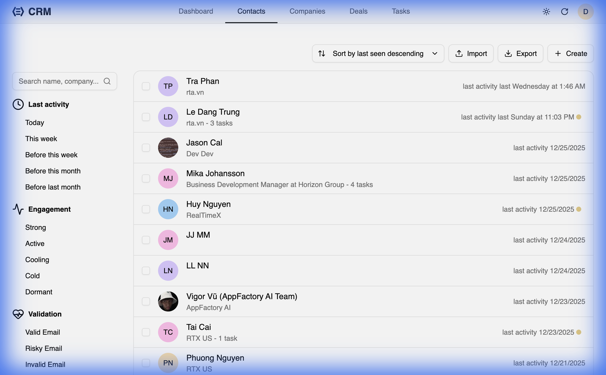
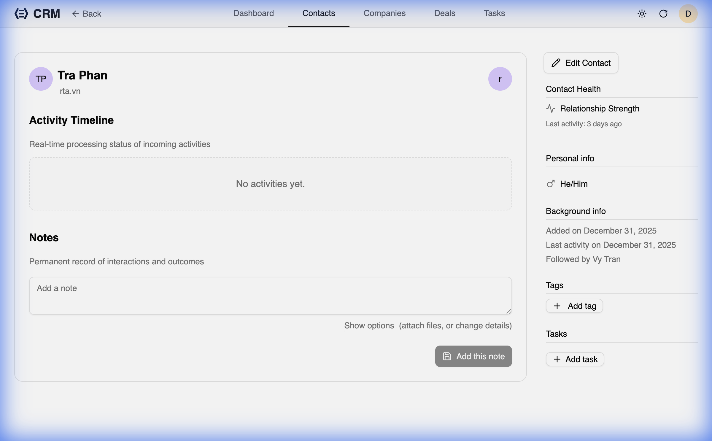
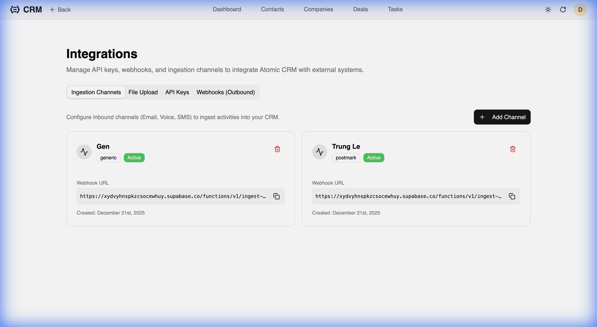

RealTimeX CRM makes it easy to keep track of everyone you do business with. From the Contacts list, you can quickly find, filter, and manage your network.

## The Contacts List

The **Contacts** page shows all your people in one place. You can filter by:
- **Last Activity**: Find who you haven't talked to in a while.
- **Engagement**: See who's "Hot," "Warm," or "Cold."
- **Status**: Track where they are in your relationship lifecycle.

## Contact Detail View

Clicking a contact opens their full profile. This is where you can see the entire history of your relationship.

### 1. Activity Timeline
The center of the page shows a chronological feed of every interaction:
- **Notes**: Thoughts, meeting minutes, or call summaries.
- **Emails**: Captured communications via the inbound email feature.
Send or forward emails to RealTimeX CRM's inbound email address to automatically add notes to the corresponding contacts. You can find this email address in **Settings > Ingestion Channels**.

- **Task completion**: Automatic records of when work was finished.

### 2. Relationship Health
The sidebar provides a quick "Relationship Strength" indicator based on how often you interact with the contact.

### 3. Background Info
Store semi-permanent information like bios, how you met, or specific preferences in the background section.

### 4. Direct Actions
From this page, you can:
- Add a new **Note**.
- Create a **Task** directly linked to the contact.
- Log a **Deal** opportunity.
