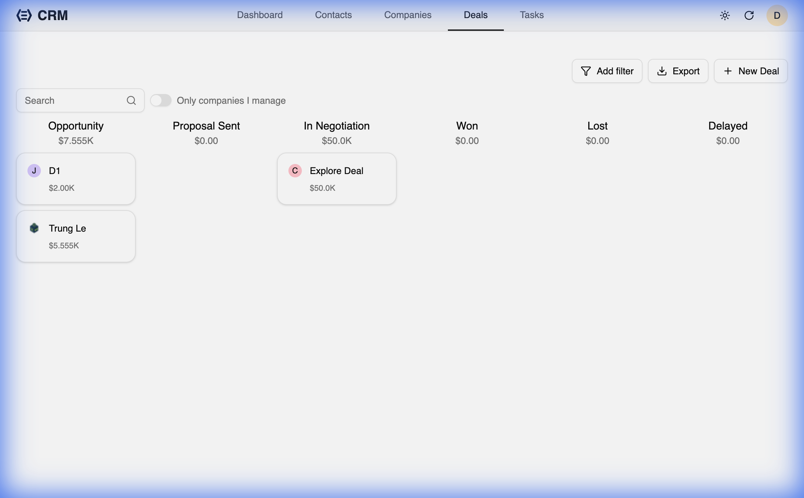
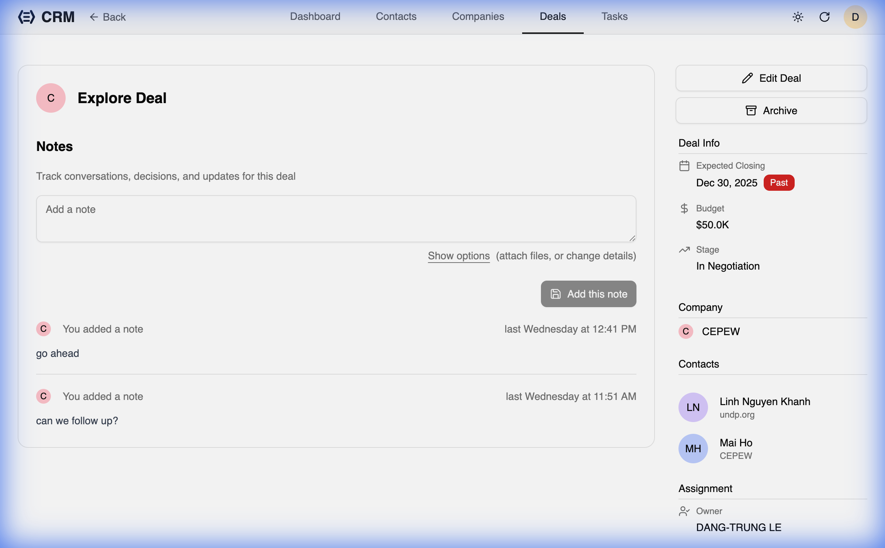

RealTimeX CRM's Deal management system is built around a polished Kanban board that helps you track progress from initial contact to closed-won.

## The Deal Pipeline

The **Deals** page features a drag-and-drop Kanban board where deals are organized by stage (e.g., Discovery, Proposal, Negotiation, Won, Lost).

### Key Features:
- **Visual Overview**: Instantly see the value and volume of deals in each stage.
- **Drag-and-Drop**: Move deals between stages as they progress.
- **Quick Filter**: Filter deals by assigned sales representative or category.

## Deal Detail View

Clicking on a deal opens a full-page detail view, providing ample space to manage complex opportunities.

### Layout:
- **Main Content**: Displays the deal's history, notes, and activity log.
- **Sidebar**: Quick access to deal metadata:
    - Associated **Company** and **Contacts**.
    - Assigned **Owner**.
    - **Category** and **Amount**.
    - Actions (Edit, Archive, Delete).

## Creating and Editing Deals

You can create a new deal directly from the Kanban board using the **Create** button. For quick updates, the **Edit** button on the Kanban card opens a dialog, while the **Edit** button in the full-page view provides a more comprehensive form.

When creating a deal, you must associate it with a **Company**. You can also link multiple **Contacts** to represent the stakeholders involved in the deal.
