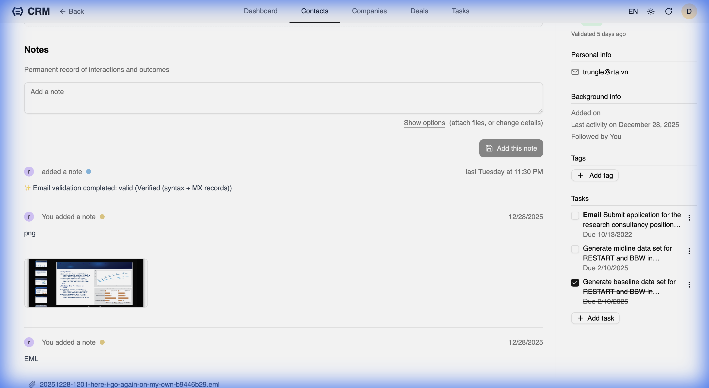

RealTimeX CRM includes a smart, self-adaptive email validation system that helps maintain a high-quality contact database. It automatically processes contacts to verify if their email addresses are valid, reachable, and not from disposable domains.

## Two-Tier Validation Strategy

The system uses a flexible two-tier approach to balance cost and accuracy:

### 1. Free Tier (Edge-Optimized)
By default, the CRM performs high-efficiency checks that don't require external paid services:
- **Syntax Validation**: Ensures the email follows proper formatting.
- **DNS MX Records**: Checks if the domain has valid Mail Exchange records to receive emails.
- **Disposable Domain Detection**: Identifies and flags "burner" email addresses from known disposable providers.
- **Typo Checking**: Detects common domain typos (e.g., `gmial.com` instead of `gmail.com`).

### 2. Premium Tier (SMTP Validation)
For maximum accuracy, you can integrate external validation services like **ZeroBounce** or **Hunter.io**. This tier performs:
- **Full SMTP Handshake**: Communicates with the mail server to verify if the specific mailbox exists without sending an email.
- **Catch-all Detection**: Identifies domains that accept all emails, which are trickier to validate.

## Automatic Validation Loops

### Automatic Validation Loop
Whenever a contact is created or its email is updated, the validation system automatically kicks in.

- **Adaptive Scheduling**: It automatically triggers validation loops as new contacts are added.
- **Priority-Based**: Active contacts (those you've interacted with recently) are validated first.
- **Rate-Limiting**: To protect your domain reputation and stay within API limits, it processes emails in small, controlled batches.

## Audit Trail

Every time a validation status changes, a note is automatically added to the contact's activity log. This provides a clear history of when and why an email was marked as valid, invalid, or risky.

## Configuration

To configure the email validation system, including adding your API keys for the Premium tier, check the [Supabase Configuration](../../developers/supabase-configuration) guide.
