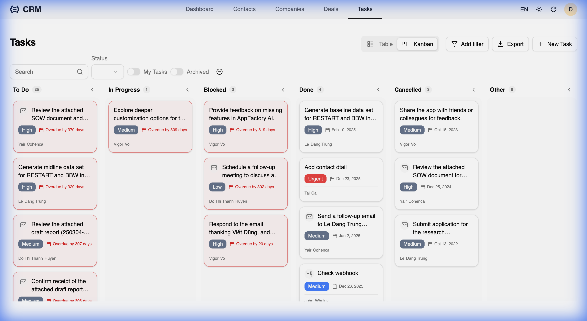

RealTimeX CRM provides a powerful Task management system with both Table and Kanban views, designed to help you stay productive and never miss a follow-up.

## Task Views

You can toggle between two views for your tasks:

### 1. Table View
The **Table View** provides a concise list of all tasks. It's ideal for bulk actions and quick status checks. 
- **Relative Due Dates**: Tasks show friendly labels like "Due today," "Overdue by 2 days," or "Due in 3 days."
- **Quick Actions**: Hover over a row to see quick actions:
    - **✓ (Complete)**: Mark the task as done immediately.
    - **✎ (Edit)**: Open the edit dialog.
    - **⏰ (Snooze)**: Postpone the task to tomorrow with one click.

### 2. Kanban View
The **Kanban View** allows you to visualize your tasks by status (To Do, In Progress, Done, etc.).

- **Drag-and-Drop**: Move tasks between columns to update their status. The order within columns is persisted.
- **Collapsible Columns**: Hide columns you don't need to keep your workspace clean. The collapsed state is saved per-user.
- **"Other" Column**: Automatically captures tasks with unknown or custom statuses, ensuring no work falls through the cracks.
- **Infinite Scroll**: Scroll through large lists of tasks effortlessly without pagination controls.

## Creating Tasks

Tasks can be created from the Tasks page or directly from a Contact, Company, or Deal's detail page.
When creating a task, you can:
- Set a **Due Date**.
- Choose a **Task Type** (Email, Call, Meeting, etc.).
- Link it to a **Contact**, **Company**, or **Deal**.
- Assign a **Priority**.

## Smart Snoozing and Postponing

RealTimeX CRM includes an intelligent snooze button that adapts to the task's context:
- **Snooze to Tomorrow**: For overdue or today's tasks.
- **Postpone by 1 Day**: For tasks due in the future.

This helps you quickly reschedule work without manually picking dates.

## Task Audit Trail

Every major action on a task (marking as complete, snoozing, updating) automatically creates a note in the task's history. This provides a full audit trail of how and when a task was managed.
